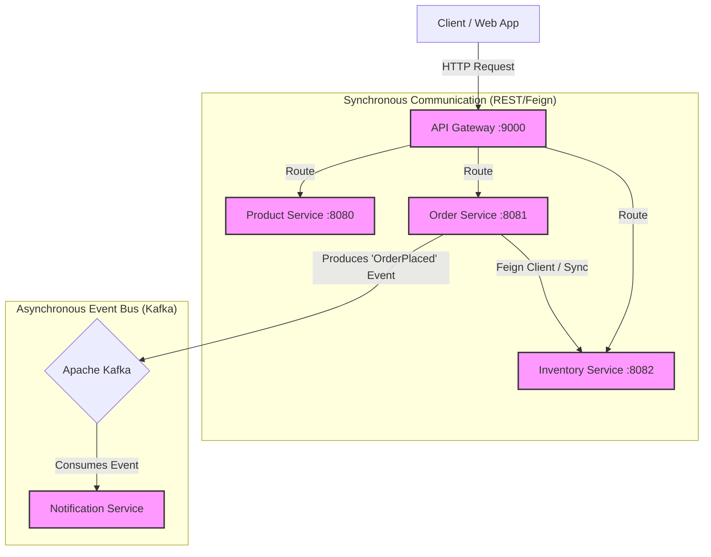

# Event-Driven Commerce Platform 🚀

[](https://www.oracle.com/java/)
[](https://spring.io/projects/spring-boot)
[](https://kafka.apache.org/)
[](https://www.docker.com/)

A scalable, distributed e-commerce backend built using **Microservices Architecture**. This project demonstrates an **Event-Driven** approach using Apache Kafka for high-throughput asynchronous processing, coupled with **Spring Cloud** patterns for resilience and service orchestration.

---

## 🏗️ System Architecture

The system is composed of loosely coupled microservices that communicate via a hybrid of **Synchronous REST APIs** (for critical read/write operations) and **Asynchronous Events** (for side effects like notifications).



---

## 💡 Key Design Decisions

### 1. Event-Driven Decoupling (Kafka)
**Problem:** In a monolithic or tightly coupled approach, placing an order blocks the user until the email service responds. If the email service is down, the order process fails.

**Solution:** Implemented **Apache Kafka** to decouple the Order Service from the Notification Service.

**Impact:** The checkout process is non-blocking. Notifications are processed eventually, ensuring high availability and fault tolerance.

### 2. Resilience & Circuit Breaking
**Problem:** If the Inventory Service is slow or down, the Order Service could hang while waiting, causing a cascading failure across the platform.

**Solution:** Applied **Circuit Breaker patterns** (via Resilience4j/Spring Cloud Circuit Breaker) in the API Gateway and Service-to-Service calls.

**Impact:** Failures are isolated. If a service is down, the system fails fast and recovers gracefully without crashing the entire backend.

### 3. API Gateway Pattern
**Role:** Acts as the single entry point for all client traffic.

**Features:** Handles centralized routing, request aggregation, and cross-cutting concerns (like basic auth placeholders).

---

## 🛠️ Tech Stack

| Category | Technology |
| :--- | :--- |
| **Core Framework** | Java 17, Spring Boot 3.x |
| **Service Discovery & Routing** | Spring Cloud Gateway |
| **Inter-Service Communication** | OpenFeign (Sync), Apache Kafka (Async) |
| **Resilience** | Resilience4j (Circuit Breaker) |
| **Data Persistence** | Spring Data JPA, PostgreSQL/MySQL (Configurable) |
| **Build & Deploy** | Maven, Docker |

---

| Service | Port | Description | Communication Style |
| :--- | :--- | :--- | :--- |
| **API Gateway** | 9000 | Central entry point & routing | HTTP Proxy |
| **Product Service** | 8080 | CRUD operations for catalog | REST API |
| **Order Service** | 8081 | Order lifecycle management | REST + Kafka Producer |
| **Inventory Service** | 8082 | Real-time stock management | REST API |
| **Notification** | N/A | Listens for order events to send emails | Kafka Consumer |

---

# 🚀 Getting Started

## Prerequisites
* **Java 17+**
* **Maven**
* **Apache Kafka** (Running locally or via Docker)
* **Optional:** Docker Desktop

---

## Quick Start (Local)

### 1. Start Kafka (Required)
Ensure **Zookeeper** and the **Kafka broker** are running on their default ports.

### 2. Clone the Repository
```bash
git clone [https://github.com/pavanSaai-theExplorer/event-driven-commerce-platform.git](https://github.com/pavanSaai-theExplorer/event-driven-commerce-platform.git)
cd event-driven-commerce-platform
```

### 3. Run the Services
You must run the services in this order to ensure dependencies are met:

* **API Gateway:** `mvn spring-boot:run` (Port 9000)
* **Inventory & Product Services:** (Ports 8082, 8080)
* **Order Service:** (Port 8081)
* **Notification Service:** (Background Consumer)

---

## 🐳 Docker Compose (Recommended)
If you have Docker installed, spin up the entire architecture with one command:

```bash
docker-compose up -d --build
```
This will provision Kafka, Zookeeper, and all microservices in a shared network.

---

## 🧪 API Endpoints (Examples)

### 📦 Place an Order

```bash
POST http://localhost:9000/api/order
Content-Type: application/json

{
  "productId": "101",
  "quantity": 2,
  "skuCode": "IPHONE_15_PRO"
}
```

---

## ✅ Expected Result

1. **Order ID created immediately**  
   - API responds with **HTTP 201 (Created)** upon successful order placement.

2. **Inventory deducted synchronously**  
   - Stock is validated and reduced in real time during order processing.

3. **"Order Placed" log appears in Notification Service console**  
   - Logged **asynchronously** after the order is successfully created.

---

## 🔮 Future Improvements

- **Distributed Tracing**
  - Implement distributed tracing using **Zipkin** and **Micrometer** to track requests across services.

- **Centralized Configuration**
  - Add a **Centralized Configuration Server** (e.g., Spring Cloud Config) for managing service configurations.

- **Kubernetes Deployment**
  - Deploy services to **Kubernetes (K8s)** using **Helm Charts** for scalable and manageable deployments.
